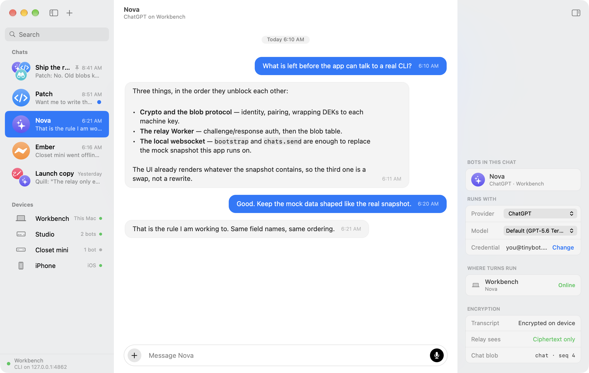
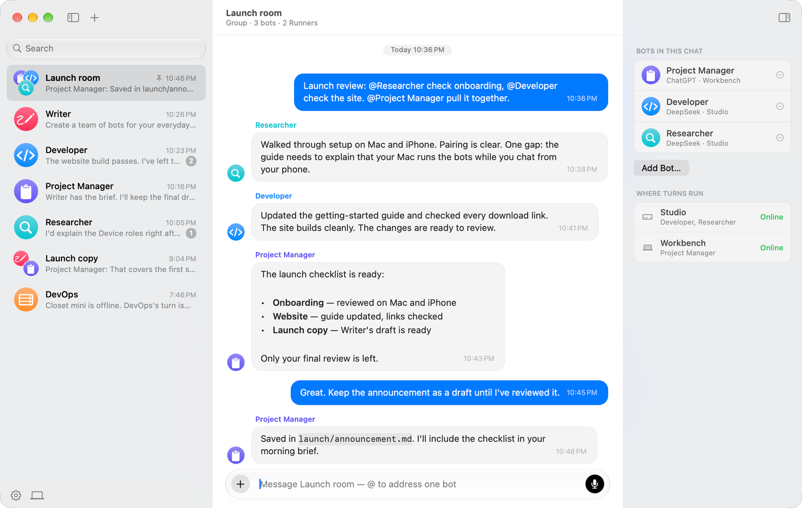
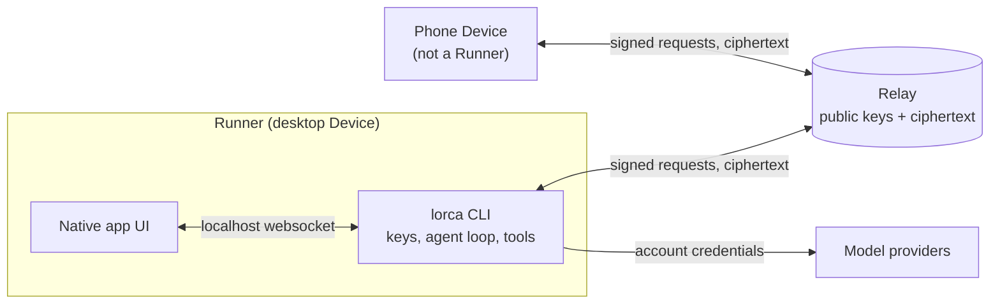

<p align="center">
  
</p>

<h1 align="center">Beans</h1>

<p align="center">
  Persistent AI bots you own: chat 1:1 or in groups, hand work between bots, and run them on your own machines.
</p>

<p align="center">
  <a href="#what-is-beans">Overview</a> ·
  <a href="#how-it-fits-together">Architecture</a> ·
  <a href="#build-from-source">Build</a> ·
  <a href="#self-hosting-the-relay">Relay</a> ·
  <a href="#security-boundaries">Security</a> ·
  <a href="#contributing">Contributing</a> ·
  <a href="#license-and-acknowledgments">License</a>
</p>

## What is Beans?

Beans is a GPL-3.0 fork of [Lorca](https://github.com/egoist/lorca): a Rust agent runtime, an end-to-end encrypted relay, and desktop and phone clients. The macOS and phone builds have their own Beans identities. Runtime identifiers (`lorca` binary, `LORCA_*` variables, `lorca://pair`) intentionally remain compatible with upstream. [BEANS.md](./BEANS.md) describes the fork.

- **Bots and chats.** Create named bots, talk to them 1:1, or put 1–6 in a group chat. Bots hand work to each other and orchestrate in the spirit of Grok Bot, and can run scheduled routines.
- **Your machines do the work.** Each bot runs on one Runner you own. Provider credentials belong to the account and sync as an encrypted blob.
- **End-to-end encrypted sync.** Identity is a local key pair. The relay stores public keys and ciphertext.
- **Offline avatar library.** [`@beans/blobatar`](./packages/beans-blobatar/README.md) supplies a deterministic, MIT-licensed avatar generator, including its JavaScriptCore distribution.
- **Fork development.** Matching client avatars, account-wide Pause, per-bot capabilities, reviewed file drafts, protocol-3 reconciliation and custom-provider catalog refresh are being integrated.
- **Clients.** macOS (AppKit), Windows and Linux (MyGo), iOS and Android (Expo).

> **Development status:** the avatar library is committed; some newer client controls and protocol changes are still in the development worktree and are not yet published on `beans`. Build and deployment acceptance are separate. Do not rely on an unpublished feature or assume a local build has upgraded your relay.

## Interface reference

These two images are inherited from the upstream Lorca website (`web/public/screens`). They illustrate the upstream chat UI and are **not** current Beans screenshots or proof that a Beans build ran.

| Direct chat (upstream) | Group chat (upstream) |
| --- | --- |
|  |  |

## How it fits together

Every paired machine or phone is a **Device** and records its OS. Desktop Devices (`macos`, `linux`, `windows`) are **Runners**: bots live and run there. Phones and tablets (`ios`, `ipados`, `android`) are Devices, never Runners; they read and write chats, configure credentials, create bots for your Runners and start turns.



- The desktop app talks only to its local CLI, and bundles and starts it.
- The CLI owns identity, the agent loop, tools, relay sync and provider calls.
- A bot runs on one Runner, using the account's provider credentials there.

Read [ARCHITECTURE.md](./ARCHITECTURE.md) first, then the subject docs in [docs/architecture](./docs/architecture) for the parts you touch.

### Supported clients and providers

| Surface | Source | Notes |
| --- | --- | --- |
| CLI | [`crates/cli`](./crates/cli) | Rust; macOS, Linux, Windows |
| macOS app | [`macos/`](./macos) | AppKit, Swift package; deployment target macOS 14, built with the macOS 26 SDK |
| Windows and Linux app | [`desktop/`](./desktop) | MyGo (Go + system webview) with a Solid page; keeps its upstream identity |
| Phone app | [`mobile/`](./mobile) | Expo (iOS, Android); pairs as a Device |
| Relay | [`crates/relay`](./crates/relay) | axum with SQLite or Postgres |

Providers: API key for DeepSeek, Anthropic, OpenCode Zen and OpenCode Go; subscription sign-in for ChatGPT and Grok (SuperGrok or X Premium+); custom providers that speak OpenAI's or Anthropic's API. See [providers](./docs/architecture/providers.md).

## Build from source

- **All builds:** [Bun](https://bun.sh) and Rust stable, with the standard libraries for the targets you build.
- **macOS:** Xcode with Swift 6 and the macOS 26 SDK. The deployment target is macOS 14; that is not a claim of verified macOS-14 runtime compatibility.
- **Windows/Linux desktop:** Go 1.27.1 or newer; cross-platform CLI builds use `cargo-zigbuild`. See [desktop architecture](./docs/architecture/desktop-app.md) for host webview dependencies.
- **Phones:** Xcode for iOS, or JDK 17 and the Android SDK/NDK for Android. Native Rust-core setup is described in [phone architecture](./docs/architecture/phone-app.md).

Start with the fork's working branch:

```bash
git clone --branch beans https://github.com/bloodf/beans.git
cd beans
bun install
```

For phone development, also run `bun install --cwd mobile`: the phone app is not a root Bun workspace.

Choose the development or build command for your platform:

```bash
bun run dev           # build and launch Beans Dev (macOS); also starts a local relay on 0.0.0.0:8787
bun run build         # build Beans.app without installing or launching it
bun run desktop       # Windows/Linux development app with live reload
bun run desktop:build # desktop release build for the host (or Linux + Windows x86-64 from a Mac)
bun run mobile:dev    # Beans Dev on the iOS simulator with Metro
bun run mobile:phone  # same loop on a connected iPhone
bun run android       # rebuild the phone core and run the Android development client
bun run relay         # local relay on 0.0.0.0:8787, database in temp/
bun run web           # website dev server on http://localhost:3000
```

`bun run relay` and `bun run dev` listen on every interface so a phone on your network can pair. Use them on trusted networks only. `bun run android:release` builds a signed APK from external signing credentials; see [BEANS.md](./BEANS.md#android-release-build).

### Beans and Beans Dev are isolated

| Build | CLI home | CLI port |
| --- | --- | --- |
| Beans (macOS) | `~/.beans` | `4864` |
| Beans Dev (macOS) | `~/.beans-dev` | `4865` |

Bundle IDs are `ai.amoena.beans` and `ai.amoena.beans.dev`. Upstream Lorca's defaults are a different installation. When you run the CLI yourself, pass the intended home and port explicitly:

```bash
cargo run -q -p lorca -- --home "$HOME/.beans-dev" --port 4865 serve
```

`bun run reset` is destructive: it resets the selected Beans installation's local data. It is not a setup prerequisite.

## Self-hosting the relay

The relay is optional for one Device and required for pairing and sync across Devices. It stores only public keys and ciphertext.

```bash
cargo run -q -p lorca-relay -- --bind 127.0.0.1:8787 --db lorca-relay.db
# or --db postgres://... for several replicas
```

- Set `LORCA_RELAY_SECRET` to a stable random value, or every Device is logged out on restart. Copy [`.env.example`](./.env.example) to `.env` (gitignored) for APNs and FCM push settings; keep key files outside the repository.
- Point clients at it with `LORCA_RELAY_URL` or Settings › Advanced. Resolution order is in [BEANS.md](./BEANS.md#relay-selection). Rust defaults are unchanged, so configure your own relay explicitly; no hosted Beans relay is provided here.
- Keep relay and clients on compatible revisions. For the in-progress protocol-3 cutover, upgrade every relay replica first and require minimum protocol 3 before upgrading clients. New clients refuse older relays; upgraded relays return `426` to older clients. See [protocols](./docs/architecture/protocols.md).
- Behind a proxy, set `LORCA_RELAY_TRUST_PROXY` only if the proxy overwrites `X-Forwarded-For`. A container image recipe is at [`crates/relay/Dockerfile`](./crates/relay/Dockerfile). Details: [relay](./docs/architecture/relay.md).

## Security boundaries

- The relay cannot read content, but it sees public keys, ciphertext sizes and timing. Do not publish relay addresses, signing material or provider keys.
- Bots run tools on their Runner with your user's permissions. Auto-review **does not sandbox** a bot; a workspace is context, not a filesystem boundary. Bots on one Runner share the operating-system user.
- The in-progress fork hardening adds local websocket Host/Origin checks, per-bot capabilities, account Pause and file-draft approval. These are not claims about the published or deployed baseline. An offline Runner cannot enforce changes it has not received. See [tools](./docs/architecture/tools.md) and [bots](./docs/architecture/bots.md).
- Beans builds do not start Sparkle or the upstream update feed. The upstream scripts `release-mac`, `release-ios`, `release-desktop` and `generate-appcast` and their `docs/releasing-*.md` guides name upstream hosting and are **not** Beans release channels.

## Repository map

| Path | Contents |
| --- | --- |
| `crates/cli`, `crates/agent`, `crates/models`, `crates/provider-auth`, `crates/markdown` | CLI, agent loop, model catalog, provider sign-in, markdown |
| `crates/relay`, `crates/mobile` | Relay; Rust Device core for phones |
| `macos/`, `desktop/`, `mobile/` | Native clients |
| `packages/beans-blobatar` | Avatar generator |
| `web/` | Landing page and Fumadocs product docs (`web/content/docs`) |
| `scripts/` | Build, dev and reset scripts |
| `docs/architecture`, [CHANGELOG.md](./CHANGELOG.md) | Subject docs and changelog |

## Contributing

Keep each change to one observable behavior. Read the architecture subject you touch and reuse its mechanism. Exercise the path with an isolated home and local fixtures, add a focused regression, and update the matching architecture doc and the changelog. A build or unit suite does not replace native UI, pairing or deployed-service evidence. Keep credentials, signing material and local operational addresses out of contributions.

Focused checks:

```bash
cargo test --locked --workspace --exclude lorca-mobile
cargo test --locked -p lorca-mobile     # separate: avoids feature unification with the Runner
bun run check:docs
bun run l10n
bun run test:mac-startup
swift test --package-path macos
bun run --cwd mobile typecheck
bun run --cwd mobile test
bun run --cwd desktop build:web
bun run --cwd desktop test
go -C desktop test ./...
```

[CI](./.github/workflows/test.yml) also covers Linux/Postgres and Windows; local macOS checks do not prove those platforms. Report exact commands, outcomes and unavailable prerequisites.

## License and acknowledgments

Beans is licensed under [GPL-3.0](./LICENSE). It builds on [Lorca](https://github.com/egoist/lorca) by egoist. The vendored Blobatar avatar source in `packages/beans-blobatar` is MIT-licensed by Alain; see its [LICENSE](./packages/beans-blobatar/LICENSE).
