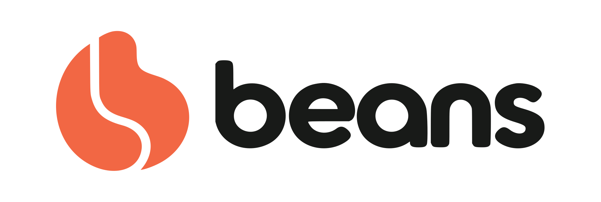
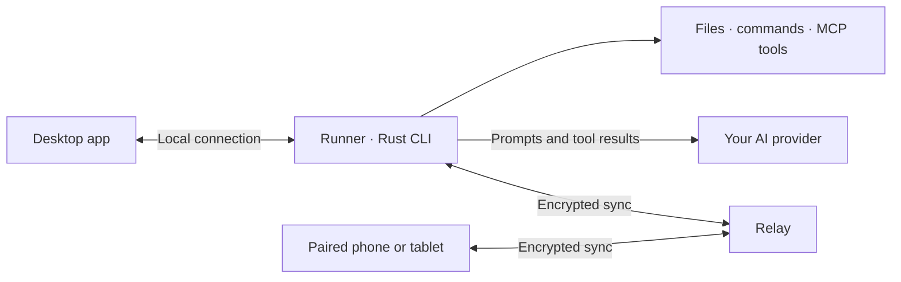

<p align="center">
  <picture>
    <source media="(prefers-color-scheme: dark)" srcset="./web/public/brand/beans-logo-light.svg">
    
  </picture>
</p>

<h1 align="center">Your AI. Your space.</h1>

<p align="center">
  A team of AI bots on your computer.<br>
  Give them work, connect your tools, and keep chatting from your phone.
</p>

<p align="center">
  <a href="https://usebeans.app/download"><strong>Download Beans</strong></a> ·
  <a href="https://usebeans.app/#turns">Try the demo</a> ·
  <a href="https://usebeans.app/docs">Read the docs</a> ·
  <a href="https://usebeans.app/compare">Compare alternatives</a>
</p>

<p align="center">
  
</p>

## Meet your team

Beans gives each bot a name, instructions, a model, and memory. Assign it to one of your computers and give it a folder to work in. Chat with it directly, or bring several bots into a group to work together.

<table>
  <tr>
    <td width="50%" valign="top">
      <h3>Bots that keep context</h3>
      <p>Keep dedicated bots for different projects. Their instructions and memory carry across chats, so you can return to the work without repeating your preferences.</p>
    </td>
    <td width="50%" valign="top">
      <h3>A team in one conversation</h3>
      <p>Put up to six bots in a group. Mention a teammate, discuss the work together, and let bots hand tasks to each other.</p>
    </td>
  </tr>
  <tr>
    <td valign="top">
      <h3>Tools on your computer</h3>
      <p>Bots read and edit files, run commands, search the web, and connect to apps through MCP plugins. Review tool permissions and see the activity in the conversation.</p>
    </td>
    <td valign="top">
      <h3>Continue from your phone</h3>
      <p>Pair your devices to read and send messages, configure bots, and start work remotely. Scheduled routines run on the bot's assigned computer.</p>
    </td>
  </tr>
</table>

The [interactive demo](https://usebeans.app/#turns) uses the actual Windows/Linux app interface. Select bots and group chats in its sidebar. It contains sample conversations and simulated replies; providers, files, and tools are disconnected.

## Start with one bot

1. [Download Beans](https://usebeans.app/download) for your computer. The download page shows the currently available builds.
2. Connect an AI provider with a supported subscription sign-in or API key.
3. Create a bot, choose its model, and assign its computer and working folder.
4. Start a conversation. Add teammates, scheduled routines, and paired devices when you need them.

Keep the assigned computer online for new turns and scheduled work. Your phone sends work to that computer; queued work waits while it is offline.

## Free app. Your choice of provider.

**Beans is free and open source.** You pay your AI provider directly for its subscription or API usage. Your computer, hosting, and any paid tools have their own costs.

Supported connections include:

- ChatGPT through subscription sign-in. Production Grok subscription OAuth is disabled pending a verified Beans OAuth/referrer contract; Grok models via API-key gateways remain separate.
- Anthropic, DeepSeek, OpenCode Zen, and OpenCode Go through API keys.
- Custom providers with OpenAI-compatible or Anthropic-compatible APIs, including reachable local model servers that implement a supported API.

Choose a provider and model for each bot. Provider availability and usage limits depend on your account. See [provider setup](https://usebeans.app/docs/providers) and the [provider architecture](./docs/architecture/providers.md) for connection details.

## Your computers do the work

A desktop computer is a **Runner**. It runs the bots assigned to it and calls your model providers. A paired phone or tablet is a **Device** that lets you chat and manage the team.



Identity starts with a local key pair. Paired devices share chats, bot profiles, and account provider credentials through an end-to-end encrypted relay. The relay stores public keys and ciphertext and sees connection metadata such as sizes and timing. Your chosen model provider receives the prompts and tool results sent to it.

Bots run tools with your operating-system user's permissions. A working folder supplies context; it is not a filesystem sandbox. Auto-review evaluates tool requests and does not provide an operating-system sandbox. Read the [identity](./docs/architecture/identity.md) and [tools](./docs/architecture/tools.md) docs for the boundaries.

## Find the right fit

Each comparison has its own page with pros, cons, costs, and source links:

[OpenClaw](https://usebeans.app/compare/openclaw) · [Hermes Agent](https://usebeans.app/compare/hermes) · [Grok Bot](https://usebeans.app/compare/grok-bot) · [OpenAI Dots](https://usebeans.app/compare/dots) · [OpenBot](https://usebeans.app/compare/openbot) · [Claude Code](https://usebeans.app/compare/claude-code)

The website is available in [English](https://usebeans.app/), [Português do Brasil](https://usebeans.app/pt-br), [简体中文](https://usebeans.app/zh), [Deutsch](https://usebeans.app/de), [Español](https://usebeans.app/es), and [日本語](https://usebeans.app/ja). Product docs are available in English and Chinese. Website translations are separate from native app language support.

## Build from source

Read [ARCHITECTURE.md](./ARCHITECTURE.md) before changing code, then the subject docs it lists for the parts you touch. The binary is `beans`, configuration uses `BEANS_*`, and pairing uses exact `beans://pair?v=2&…` links.

Install [Bun](https://bun.sh) and Rust stable. macOS builds need Xcode with Swift 6 and the macOS 26 SDK. Windows/Linux desktop builds need Go 1.27.1 or newer and the host webview dependencies. Phone builds need Xcode for iOS, or JDK 17 and the Android SDK/NDK for Android. See the [macOS](./docs/architecture/macos-app.md), [desktop](./docs/architecture/desktop-app.md), and [phone](./docs/architecture/phone-app.md) build docs.

```bash
git clone https://github.com/bloodf/beans.git
cd beans
# To reproduce a release, check out its beans-v<version> tag before installing.
bun install
```

Choose the command for your platform:

```bash
bun run dev           # Build and launch Beans Dev on macOS, with a local relay
bun run build         # Build Beans.app
bun run desktop       # Windows/Linux development app with live reload
bun run desktop:build # Build the desktop release artifacts
bun run mobile:dev    # iOS simulator development with Metro
bun run mobile:phone  # Development on a connected iPhone
bun run android       # Rebuild the Rust phone core and run the Android client
bun run web           # Website development on localhost:3000
```

For phone development, first run `bun install --cwd mobile`. The phone app is not a root Bun workspace. Desktop cross-compilation uses `cargo-zigbuild`; platform prerequisites and packaging details are in the build docs above.

Beans uses `~/.beans-v2` and CLI port `4874`; Beans Dev uses `~/.beans-dev-v2` and `4875`. Phone cores use `beans-v2/core` or `beans-dev-v2/core` inside the existing OS sandbox. Format `beans-v2`, protocol 5 and versioned backups are intentionally incompatible with old accounts, unversioned phrases and mixed paired Devices. No migration/reset occurs; existing accounts, installed apps and services remain untouched. To run the development CLI directly:

```bash
cargo run -q -p beans -- --home "$HOME/.beans-dev-v2" --port 4875 serve
```

`bun run dev` starts its local relay on every network interface so phones can pair. Use a trusted network. `bun run reset` deletes local installation data; it is not a setup prerequisite.

New backup phrases start with the separate token `beans-v2`, followed by thirteen base32 groups. Restore rejects missing/wrong prefixes before decoding. Do not reuse or reset an existing account directory to make a fresh build start. Relay account requests carry `Beans-Protocol: 5` and `Beans-Format: beans-v2`; incompatible storage and peers fail closed.


### Run your own relay

A relay enables pairing and sync across devices. Run a local instance with:

```bash
cargo run -q -p beans-relay -- --bind 127.0.0.1:8787 --db beans-relay.db
```

Set `BEANS_RELAY_SECRET` to a stable random value so devices remain authenticated across restarts. Configure clients through `BEANS_RELAY_URL` or Settings > Advanced; no production relay is guessed. [`.env.example`](./.env.example) documents push settings. Keep credentials and signing keys outside the repository.

The relay supports SQLite or Postgres and has a [container recipe](./crates/relay/Dockerfile). Follow the [relay](./docs/architecture/relay.md) and [protocol](./docs/architecture/protocols.md) docs for deployment, proxy configuration, and compatible client upgrades.

### Source and releases

| Directory | Contents |
| --- | --- |
| [`crates/`](./crates) | Rust CLI, agent runtime, providers, model catalog, relay, and phone core |
| [`macos/`](./macos) | AppKit macOS app |
| [`desktop/`](./desktop) | Go and Solid Windows/Linux app |
| [`mobile/`](./mobile) | Expo phone app |
| [`web/`](./web) | Marketing website and product docs |
| [`design/brand/`](./design/brand) | Editable SVG logo masters, campaign artwork, and brand exports |
| [`packages/beans-blobatar/`](./packages/beans-blobatar) | Offline avatar generator |
| [`docs/architecture/`](./docs/architecture) | Architecture subject docs |

Beans releases use signed readiness metadata. macOS release bundles check the Beans Sparkle feed for updates; development builds do not start update checks. Build validation, signed artifact publication, and store submission are separate steps described in [releases](./docs/architecture/releases.md).

## Contributing

Keep changes focused on an observable behavior. Exercise the path with an isolated home and local fixtures, update the architecture subject for any mechanism you change, and record the change in [CHANGELOG.md](./CHANGELOG.md).

Run the checks relevant to your change:

```bash
cargo test --locked --workspace --exclude beans-mobile
cargo test --locked -p beans-mobile # Separate to avoid Runner feature unification
bun run check:docs
bun run l10n
bun run test:mac-startup
swift test --package-path macos
bun run --cwd mobile typecheck
bun run --cwd mobile test
bun run --cwd desktop build:web
bun run --cwd desktop test
go -C desktop test ./...
```

[CI](./.github/workflows/test.yml) also checks Linux/Postgres and Windows. Report the commands you ran and any unavailable prerequisites. Native UI, pairing, and deployed services need their own verification.

## License and credits

Beans is licensed under [GPL-3.0-only](./LICENSE) and builds on [Lorca](https://github.com/egoist/lorca) by egoist, preserving its source history and required attribution. The vendored Blobatar avatar source by Alain is [MIT-licensed](./packages/beans-blobatar/LICENSE).

The read-only tracked-name check takes the provenance name explicitly: `bun run scripts/check-tracked-names.ts Lorca`. It inspects tracked paths/content, allows provenance only here and preserves its enumerated required legal notices; run it after tracked path moves are reconciled.


[Website](https://usebeans.app/) · [Downloads](https://usebeans.app/download) · [Documentation](https://usebeans.app/docs) · [Releases](https://github.com/bloodf/beans/releases) · [Privacy](https://usebeans.app/privacy.html) · [Support](https://usebeans.app/support.html)
